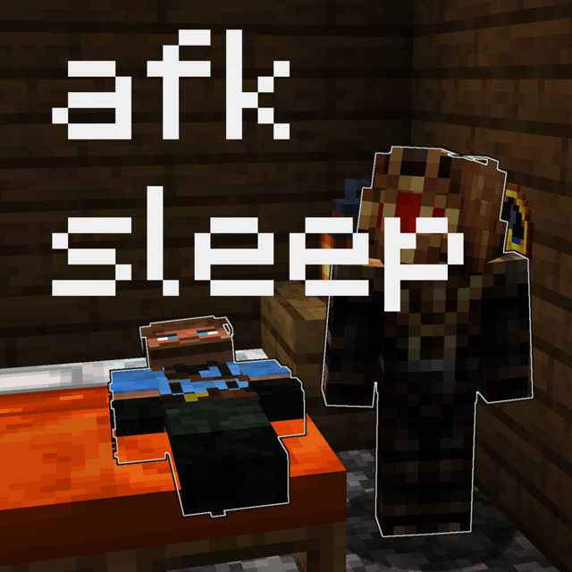
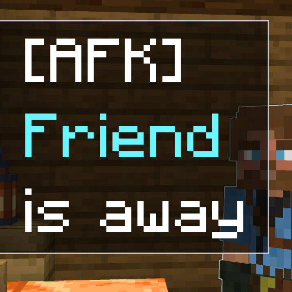
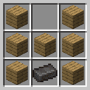
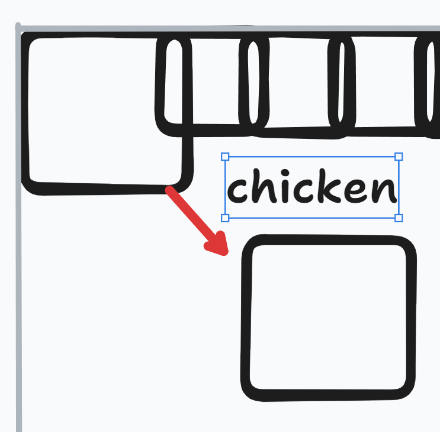
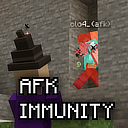

# clo4's Minecraft datapacks

Collection of all of my datapacks. These are typically focused on SMP server
administration because that's what I find myself needing more tooling for.

Keeping everything in the same repository makes it easier to build stuff fast!

## Table of Contents

- [clo4's Minecraft datapacks](#clo4s-minecraft-datapacks)
  - [Table of Contents](#table-of-contents)
  - [Datapacks](#datapacks)
    - [Detect AFK Players](#detect-afk-players)
    - [AFK Sleep](#afk-sleep)
    - [AFK Message](#afk-message)
    - [AFK Dim Names](#afk-dim-names)
    - [Pause Day Cycle](#pause-day-cycle)
    - [No Free Deaths](#no-free-deaths)
    - [No Sprinting](#no-sprinting)
    - [No Sprint-Swimming](#no-sprint-swimming)
    - [Expensive Boats](#expensive-boats)
    - [Chickenfix](#chickenfix)
    - [No Sleep (unreleased)](#no-sleep-unreleased)
    - [AFK Immunity (unreleased)](#afk-immunity-unreleased)
    - [AFK Kick (unreleased)](#afk-kick-unreleased)
  - [Nix Build System](#nix-build-system)
  - [Contributing](#contributing)
    - [Philosophy](#philosophy)

## Datapacks


### Detect AFK Players

[View and download on Modrinth](https://modrinth.com/datapack/detect-afk)

<br>

A simple way to detect AFK players for vanilla or modded servers, which allows
you to build additional social signalling mechanics and improve the experience
for all players.

Players are marked as AFK (`afk`) after 3 minutes of without moving the mouse.

The base **afk** data pack implements the AFK detection behavior, acting as a
library for other data packs. Players are treated as AFK after not sending a
directional input for more than 3 minutes (180 seconds, 3600 game ticks).

This datapack also gives players the `afk` tag when they become AFK, and removes
it when they return. This allows you to detect AFK players without having to
install any other datapacks, making it very easy to integrate with.

There is a README included in the pack and viewable in the [afk](afk) directory
with further instructions for configuration, buildng add-on packs, and
implementation details.

---



### AFK Sleep

[View and download on Modrinth](https://modrinth.com/datapack/afk-sleep)

<br>

Changes the `playersSleepingPercentage` to allow sleeping while there are AFK
players on the server.

When the datapack is initially installed, the `playersSleepingPercentage` is
stored and used as _the percentage of players that aren't AFK_ that need to
sleep for a night to pass.

| Players online | Players not AFK | Initial playersSleepingPercentage | Players required to pass a night |
| -------------- | --------------- | --------------------------------- | -------------------------------- |
| 3              | 3               | 100%                              | 3                                |
| 3              | 2               | 100%                              | 2                                |
| 3              | 2               | 50%                               | 1                                |

---



### AFK Message

[View and download on Modrinth](https://modrinth.com/datapack/afk-message)

<br>

Using this datapack will announce to all players on the server when someone
becomes AFK or returns to the game.

---


### AFK Dim Names

[View and download on Modrinth](https://modrinth.com/datapack/afk-dim-names)

<br>

Using this datapack colors the names of AFK players gray and moves them to the
bottom of the player list.

---


### Pause Day Cycle

[View and download on Modrinth](https://modrinth.com/datapack/pause-day-cycle)

<br>

A very lightweight datapack that disables `doDaylightCycle` when nobody is
online or everyone online is tagged as `afk` (see #detect-afk-players). It's
best suited for small to medium sized servers where there are large stretches of
time that nobody will be online, or long periods where players may be AFK (eg.
at a mob grinder overnight). This is to prevent the local difficulty and day
count from becoming excessive and not representative of the amount of time that
players have actually played on the server.

The following gamerules are affected:

- `doDaylightCycle`
- `doWeatherCycle`

The gamerule `mobSpawning` is unaffected to allow mob grinders and automatic
farms to function with nobody present or an AFK player loading the chunk.

You can hook into the pause and resume events using the `pause_day_cycle:pause`
and `pause_day_cycle:resume` function tags, which will be called whenever the
day cycle pauses or resumes.

---


### No Free Deaths

[View and download on Modrinth](https://modrinth.com/datapack/afk-dim-names)

<br>

Adds consequences to death when playing with `keepInventory`. By adding
carefully thought out penalties, players don't abuse death as a free
teleportation tool and hunger reset.

**Core features**

- Can be disabled per player
- Curse of Vanishing works as expected (requires Minecraft 1.20.5+)
- Players respawn with a hunger penalty
- Lose levels on death like in vanilla
- Difficulty based XP-loss
  - Easy: 50%, Normal: 75%, Hard: 100%

Players can be opted out of the consequences if they prefer a more relaxed
gaming experience. Per-player opt-out means _everyone_ can play how they want
to.

```mcfunction
/execute as USERNAME run function no_free_deaths:cmd/opt_out
```

Every penalty can be toggled individually:

```mcfunction
function no_free_deaths:cmd/toggle_drop_xp
function no_free_deaths:cmd/toggle_curse_of_vanishing
function no_free_deaths:cmd/toggle_respawn_hunger_penalty

# NOT ENABLED BY DEFAULT
function no_free_deaths:cmd/toggle_respawn_health_penalty
```

The percentage of levels lost on death is set automatically when the data pack
is loaded and will not be changed unless it is manually updated. It's a bit
verbose, but can be changed to a custom amount e.g. `90` to lose 90% of levels.

```mcfunction
/scoreboard players set .drop_percentage no_free_deaths.drop_xp.settings [percent]
```

---


### No Sprinting

[View and download on Modrinth](https://modrinth.com/datapack/no-sprinting)

<br>

When you move 30% faster with very little penalty, or for a slightly larger
penalty can effectively double your movement speed by sprint-jumping, you shrink
the scale of the world from a huge environment to a small sandbox where you can
decide where you are at any given time.

---


### No Sprint-Swimming

[View and download on Modrinth](https://modrinth.com/datapack/no-sprint-swimming)

<br>

Sprint-swimming makes water easily traversable. You have a high degree of
vertical and horizontal movement. I think the game is more fun when water is an
obstacle rather than an annoyance.

---



### Expensive Boats

[View and download on Modrinth](https://modrinth.com/datapack/expensive-boats)

<Br>

Boats shrink the effective size of continents from hours of traversal,
exploration, distraction, and fun to a few minutes of holding <kbd>w</kbd> and
scrolling your favorite time-wasting app.

---



### Chickenfix

[View and download on Modrinth](https://modrinth.com/datapack/chickenfix)

<br>

A simple but effective brute force fix to chickens suffocating in walls when
they grow up in a cramped, inhumane chicken farm.

It works by teleporting chickens to the center of the block they're in, on the
tick where they grow into an adult. This prevents them from being shoved into a
wall and suffocating. This is only done if the chicken is within five blocks of
any entity named exactly `chickenfix`, to prevent normal (humane) chicken farms
from being broken by the same logic that fixes the inhumane ones.

**If you need this, you know you need it. If you don't know, you definitely
don't need it.**

**I also make no guarantees that this will actually fix your problem. It works
for me.**

This is extremely cursed. It's a bad fix for a niche problem, and as such, I
gave it a horrible icon to deter people that do not absolutely need this fix
from using it. I'm also not releasing it as a mod, because that would also imply
that I want other people using it.

---


### No Sleep (unreleased)

Disables sleeping. Placeholder icon.

When you disable sleeping, you also need to disable phantoms. When you disable
phantoms, you need to come up with a way to get phantom membrane. I haven't
solved the membrane in a way that's fun.

The best idea I've come up with is to spawn phantoms if a player drinks a potion
of weakness and tries to use a bed.

---



### AFK Immunity (unreleased)

AFK players cannot take any damage and their armor will not lose durability.

This is designed so players don't have to consider whether they're in a good
position to do something that is more critical or productive than playing Block
Game.

It's recommended that players do not have the `afk` trigger enabled, as it
becomes an exploit if players can toggle invulnerability whenever they want.

This data pack is relatively close to being released, but there is still more
playtesting required, and probably some more edge cases to consider.

---


### AFK Kick (unreleased)

Kicks players after they have been AFK for a configurable period of time.

This requires the function level to be set higher than I'm generally comfortable
recommending, but I will likely release this eventually.

---

## Nix Build System

The build system is a reusable component built with Nix. You can use this
repository as an input to your own if you would like to use the same logic to
build. It would be relatively easy to extend to build a project using the Beet
toolchain, too.

Run this command to generate a flake with a single data pack in the repository
root.

```bash
nix flake init -t github:clo4/datapacks
```

Run this command to generate a flake with multiple data packs in subdirectories.

```bash
nix flake init -t github:clo4/datapacks#monorepo
```

If you're running into issues with the pack formats causing your build to fail,
make sure you have the latest version of this flake. It may be, at most, 6h15m
hours out of date.

```bash
nix flake update
```

## Contributing

The datapacks are built using Nix. You must have Nix installed if you want to
build locally. If you've never used it before, it's really not as scary as it
sounds - just [install Nix](https://install.determinate.systems/), and run
`nix build` to build all the datapacks, or to build an individual datapack, run
`nix build .#<name>` where `<name>` is something like `afk` or
`pause-day-cycle`. However, if you're on Windows, to use Nix you'll have to use
WSL, which can be a bit of a pain for doing stuff on your local Windows file
system too - I don't really have a good solution for you, but this project does
use GitHub Actions to build the project in CI and publishes an artifact from
that.

There's a shortcut for copying to a testing world too. Create a `.env` file in
the root of the repository, and export a variable named `DATAPACK_DIR` (a path
to a world's 'datapacks' directory). Then, you can either run the script using
`nix run .#`, or as `build-and-copy` in the dev shell. If you're using direnv
and have approved the .envrc, this script will already be available to you in
your environment. This script optionally takes the names of the data packs to
build. See the `--help` output for more information.

### Philosophy

I value composability over functionality, preferring to have less built in to
datapacks and allowing you to build the features you need on top of it. Each
piece of functionality can be small and performant, and they can be combined
together to create something more complicated without sacrificing on
maintainability or performance.

I only work on what I feel motivated to work on, because this isn't my job. I
just do it for fun and to make my own life easier. But if there's a feature that
you want added, you're welcome to create an issue for it and I'll take a look,
I'll build it if I think it's worth the time. Or you can contribute it yourself,
and we'll get it merged and released!
